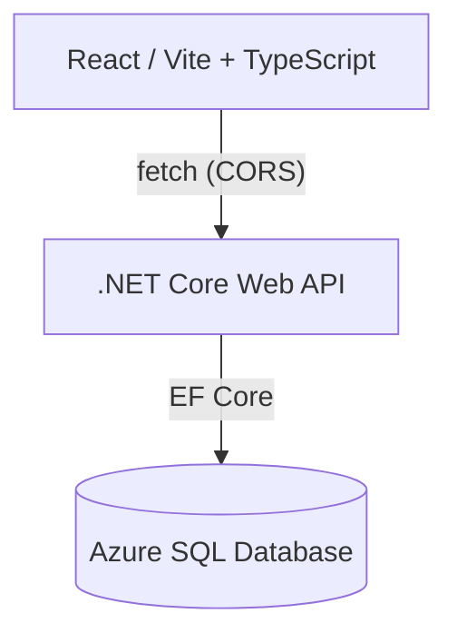

# Adelaide Library Map
An interactive web application that visualises public libraries in Adelaide on a map,  
showing their locations and availability at a glance.

This project is built as a **portfolio application** to demonstrate modern full-stack web development using **React, .NET, and Azure**.

---

## Background & Motivation
Have you ever finished an errand and wondered, "Are there any libraries nearby where I can stop by for a bit? Which one stays open the latest?"
I built this tool to solve that exact problem, to allow anyone to instantly compare the locations and opening hours of multiple libraries at a glance.
This project is dedicated to everyone who works hard every day. I hope this map supports your journey, even in a small way.

---

## Live Demo
- **Frontend (Azure Static Web Apps)**  
  https://gray-mud-0fd63cf00.1.azurestaticapps.net

- **Backend API (Azure App Service)**  
  https://library-map-api-xxxxx.azurewebsites.net/api/libraries

---

## Architecture Overview
The frontend and backend are deployed independently and communicate via APIs.


---

## Design Key Points
- Frontend and backend are deployed independently
- CORS is explicitly configured for production and local development
- **Database schema is managed via EF Core migrations**
- **Production database is hosted on Azure SQL Database**
- Environment-specific configuration via application settings and environment variables

---

## Features
- Interactive map view (Leaflet)
- Library markers loaded dynamically from API
- Environment-aware configuration (Dev / Production)
- Explicit database migration management
- Deployed on Azure with GitHub Actions

---

## Design Decisions
- To minimise operational costs, Leaflet was chosen instead of Google Maps for map rendering.
- Due to Google API licensing restrictions, data retrieved from Google services cannot be persistently stored.
- Facility data is therefore primarily sourced from **OpenStreetMap (OSM)**.
- Any missing or incomplete information in OSM has been manually supplemented.
- In future iterations, **Google Place ID will be used to periodically validate the consistency and accuracy of facility data**.

---

## Tech Stack
### Frontend
- React
- TypeScript
- Vite
- Tailwind CSS
- Leaflet

### Backend
- ASP.NET Core Web API
- Entity Framework Core
- **SQL Server (local development)**
- **Azure SQL Database (production)**

### Infrastructure
- Azure Static Web Apps (Frontend)
- Azure App Service (Backend API)
- Azure SQL Database
- GitHub Actions (CI/CD)

---

## CORS Configuration

CORS is configured explicitly in the API to allow access from:

- Local development  
  `http://localhost:5173`
- Production frontend  
  `https://gray-mud-0fd63cf00.1.azurestaticapps.net`

This ensures secure cross-origin communication between the frontend and backend.

---

## Database Strategy

- **Local development uses a local SQL Server instance**
- **Production uses Azure SQL Database**
- The same EF Core SQL Server provider is used across environments
- Database schema changes are managed via EF Core migrations

### Migration Policy

- Migrations are **not executed automatically on application startup**
- Schema changes are applied explicitly using EF Core migration commands
- This approach avoids unintended schema changes in production environments and reflects production-safe practices

---

## Local Development
### Frontend
```bash
npm install
npm run dev
```
### Backend
```bash
dotnet restore
dotnet run
```
Make sure the API is running before starting the frontend.

---

## Future Improvements
- Date/time-based opening status support
- Handling of irregular hours (holidays, year-end periods)
- Periodic data validation using Google Place ID
- **Scheduled background job for automated verification**
- Optional migration to Azure SQL as data and feature requirements grow
- API health check endpoint
- Refactor redundant structures for maintainability

---

## Author
Mei Takagi.
Master of Computer Science (AI).
Aspiring Full-Stack / .NET / Cloud Engineer.

## License
This project is for educational and portfolio purposes.
